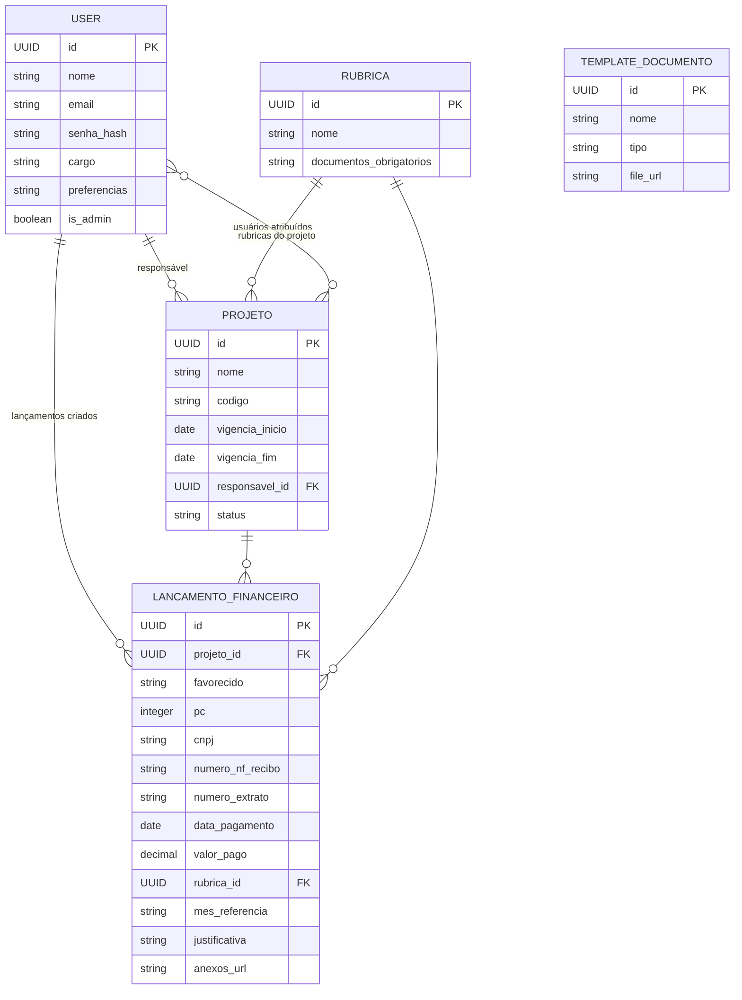

```mermaid
erDiagram

  USER {
    UUID id PK
    string nome
    string email
    string senha_hash
    string cargo
    string preferencias
    boolean is_admin
  }

  PROJETO {
    UUID id PK
    string nome
    string codigo
    date vigencia_inicio
    date vigencia_fim
    UUID responsavel_id FK
    string status
  }

  RUBRICA {
    UUID id PK
    string nome
    string documentos_obrigatorios
  }

  LANCAMENTO_FINANCEIRO {
    UUID id PK
    UUID projeto_id FK
    string favorecido
    integer pc
    string cnpj
    string numero_nf_recibo
    string numero_extrato
    date data_pagamento
    decimal valor_pago
    UUID rubrica_id FK
    string mes_referencia
    string justificativa
    string anexos_url
  }

  TEMPLATE_DOCUMENTO {
    UUID id PK
    string nome
    string tipo
    string file_url
  }

  USER ||--o{ PROJETO: "responsável"
  USER ||--o{ LANCAMENTO_FINANCEIRO: "lançamentos criados"
  PROJETO ||--o{ LANCAMENTO_FINANCEIRO: ""
  RUBRICA ||--o{ LANCAMENTO_FINANCEIRO: ""
  PROJETO }o--o{ USER: "usuários atribuídos"
  RUBRICA ||--o{ PROJETO: "rubricas do projeto"
```
